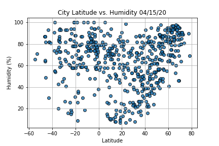
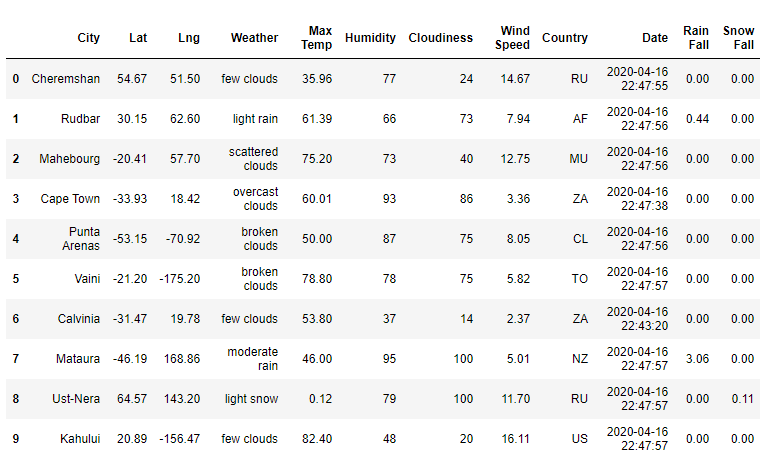
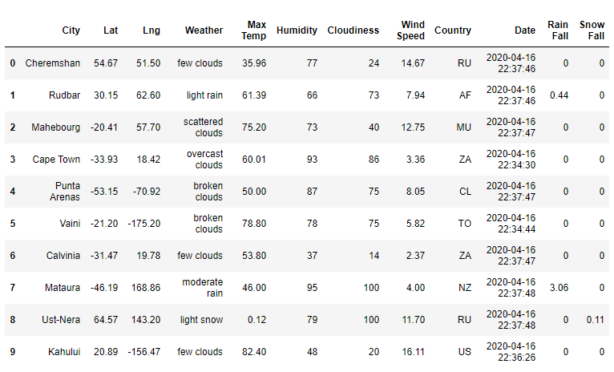
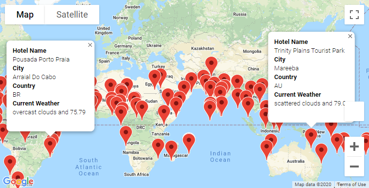
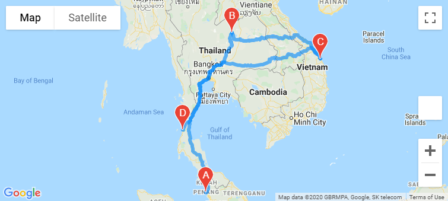
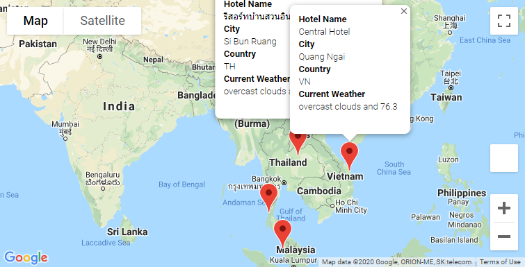

# World_Weather_Analysis

## Project Overview
We've been tasked by PlanMyTrip, a travel technology company, to collect and present data obtained from the website search page in order to find the ideal hotels in the world based on weather criteria.

## Resources
- Python 3.7.6, Anaconda 4.8.3, Jupyter Notebook-Gmap, Python Requests, JSON Traversals
- Pandas Library, CitiPy, NumPy, SciPy, Matplotlib
- APIs (OpenWeather, Gmap) 

## Summary
- Using NumPy module, we generated a list of 1,500 random latitudes and longitudes, which made a list of more than 500 cities, using CitiPy. We then used the Open Weather API, and parsed the JSON data to get the weather for each of them.

  

- We created scatter plots to visualize the relation between latitude and temperature/humidity/cloudiness/wind speed.

  

- We created creating linear regression graphs to determine the correlations between latitude and the same weather data

  

- We createds heat maps, using Google Maps/Places API showcasing the same correlations

     

- After we filtered our lict of cities by the customer's preferred min and max temperatures, we found a hotel nearby each location using Goodle Maps/Places API and Search Nearby fetaures, and created a heat map displaying info about the city, current temperature and hotel name.
  

## Challenge Overview
We've been asked to add the weather description in each pop-up marker, a second filter about rain and snow condition, and a travel map for chosen destination points.

## Challenge Summary

- Part 1: from our list of random coordinates, we generated a new DataFrame of cities, and performed an API call to the OpenWeatherMap to retieve the weather description and the amount of rain and snow fall on top of the info we collected before. We then created a new weather DataFrame. Using np.count_nonzero() we could tell that 92 cities have recorded rain fall, and 22 cities have recorded snow fall.

  

- Part 2: we filtered our DataFrame by preferred min/max temperature, and desire to see rain or snow, after prompting tyhe customer.We could then create a new Hotel DataFrame, and a marker map with hotel name, country, weather description and temperature for each marker.

    

- Part 3: after choosing 4 cities in close proximity from the customer's possible travel destinations, using gmap direction layers, we created a travel routes map between these 4 destinations, and a final marker map with the info pop-up marker(hotel name, country, weather, temperature).

    

